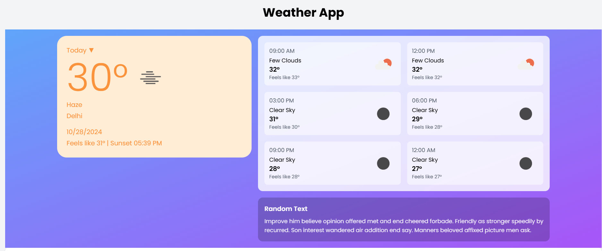
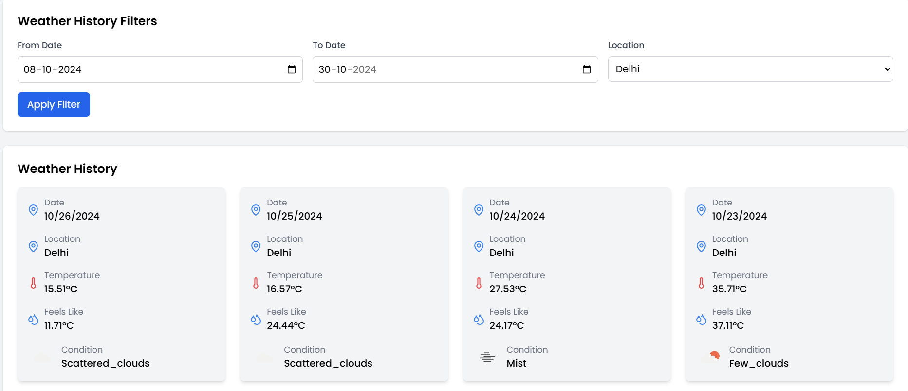
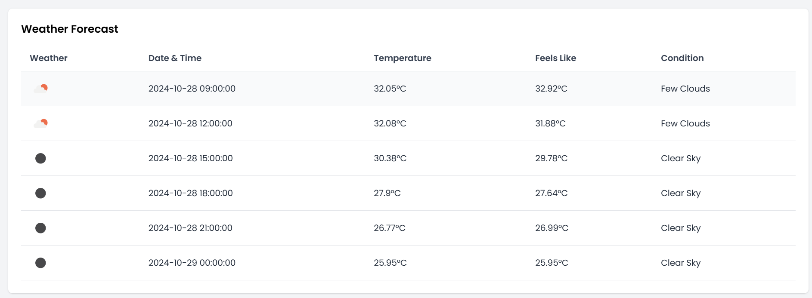

# Weather App 🌦️

A full-stack weather app built with **React** for the frontend and **Node.js with Apollo GraphQL** for the backend. Users can view the current weather, weather history, and forecast for multiple locations with filters for date ranges.

---

## Features
- 🌐 **Current Weather**: Display real-time weather for selected locations.
- 📅 **Weather History**: View past weather data based on date filters.
- 🔮 **Forecast**: See weather forecasts for upcoming days.

---

## Screenshots

### 1. Current Weather  


### 2. Weather History  


### 3. Forecast  


---

## Prerequisites

Ensure you have the following installed:

- **Node.js** (v14+)
- **npm** or **yarn**

---

## Project Setup

### Clone the Repository

```bash
git clone https://github.com/Saurabhsanjay/weather-app
cd weather-app
```

---

### 1. Backend Setup (Node.js)

Navigate to the server folder:

```bash
cd server
```

Install dependencies:

```bash
npm install
```

Start the backend server:

```bash
npm run dev
```

The backend will run on **http://localhost:4000**.

---

### 2. Frontend Setup (React)

Navigate to the client folder:

```bash
cd ../client
```

Install dependencies:

```bash
npm install
```

Start the frontend:

```bash
npm run dev
```

The frontend will run on **http://localhost:5173** 

---

## Usage

1. Open the frontend in your browser at `http://localhost:5173`.
2. Select a location and date range using the filters.
3. Click the **Filter** button to fetch weather data for the specified range.
4. View the current weather, weather history, and forecast in a user-friendly interface.

---

## Technologies Used

- **Frontend**: React, TypeScript, Tailwind CSS
- **Backend**: Node.js, Apollo Server, GraphQL
- **Weather API**: (OpenWeatherMap API)
- **Toast Notifications**: React Hot Toast

---


